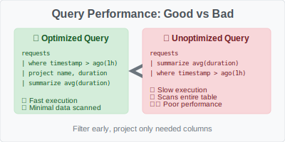

# KQL Cheat Sheet for Real Time Intelligence


A comprehensive reference for Kusto Query Language (KQL) specifically tailored for Real Time Intelligence scenarios.

## 🎯 KQL Query Flow


## Table of Contents
- [Basic Syntax](#basic-syntax)
- [Data Types](#data-types)
- [Common Operators](#common-operators)
- [Time Functions](#time-functions)
- [Aggregations](#aggregations)
- [Joins](#joins)
- [Advanced Patterns](#advanced-patterns)
- [Performance Tips](#performance-tips)
- [Real Time Intelligence Specific](#real-time-intelligence-specific)
- [Security & Threat Hunting](#security--threat-hunting)
- [Community Queries](#community-queries)

## Basic Syntax

### Table Selection and Basic Filtering

> 📚 **Documentation**: [`where` operator](https://docs.microsoft.com/azure/data-explorer/kusto/query/whereoperator) | [Query fundamentals](https://docs.microsoft.com/azure/data-explorer/kusto/query/tutorial)

```kql
// Basic table query
TableName

// Filter by specific condition
TableName
| where ColumnName == "value"

// Multiple conditions
TableName
| where ColumnName == "value" and TimeGenerated > ago(1h)

// Case-insensitive string comparison
TableName
| where ColumnName =~ "value"
```

### Common Projections

> 📚 **Documentation**: [`project` operator](https://docs.microsoft.com/azure/data-explorer/kusto/query/projectoperator) | [`extend` operator](https://docs.microsoft.com/azure/data-explorer/kusto/query/extendoperator)
```kql
// Select specific columns
TableName
| project TimeGenerated, ColumnName, AnotherColumn

// Rename columns
TableName
| project Timestamp = TimeGenerated, Name = ColumnName

// Create calculated columns
TableName
| project TimeGenerated, Duration = EndTime - StartTime
```

## Data Types


### String Operations

> 📚 **Documentation**: [String operators](https://docs.microsoft.com/azure/data-explorer/kusto/query/datatypes-string-operators) | [`extract()` function](https://docs.microsoft.com/azure/data-explorer/kusto/query/extractfunction) | [`split()` function](https://docs.microsoft.com/azure/data-explorer/kusto/query/splitfunction)
```kql
// Contains (case-insensitive)
| where Message contains "error"

// Starts with
| where EventName startswith "Microsoft"

// Regular expressions
| where Message matches regex @"Error \d+"

// String extraction
| extend ErrorCode = extract(@"Error (\d+)", 1, Message)

// String splitting
| extend Parts = split(Message, ";")
```

### Numeric Operations
```kql
// Basic math
| extend Total = Quantity * Price

// Rounding
| extend RoundedValue = round(Value, 2)

// Absolute value
| extend AbsValue = abs(Value)
```

### DateTime Operations
```kql
// Current time
| extend Now = now()

// Time ago
| where TimeGenerated > ago(1h)
| where TimeGenerated > ago(7d)

// Date formatting
| extend FormattedDate = format_datetime(TimeGenerated, "yyyy-MM-dd HH:mm")

// Date parts
| extend Hour = datetime_part("hour", TimeGenerated)
| extend DayOfWeek = dayofweek(TimeGenerated)
```

## Common Operators

### Filtering
```kql
// In operator
| where EventLevel in ("Error", "Warning")

// Between
| where ResponseTime between (100 .. 500)

// Not null
| where isnotnull(ColumnName)

// Empty or null
| where isempty(ColumnName) or isnull(ColumnName)
```

### Sorting and Limiting
```kql
// Sort ascending
| sort by TimeGenerated asc

// Sort descending (default)
| sort by Count desc

// Top N records
| top 10 by Count desc

// Skip and take (pagination)
| sort by TimeGenerated desc
| serialize rn = row_number()
| where rn > 10 and rn <= 20
```

## Time Functions

### Time Ranges

> 📚 **Documentation**: [`ago()` function](https://docs.microsoft.com/azure/data-explorer/kusto/query/agofunction) | [`bin()` function](https://docs.microsoft.com/azure/data-explorer/kusto/query/binfunction) | [Datetime/timespan arithmetic](https://docs.microsoft.com/azure/data-explorer/kusto/query/datetime-timespan-arithmetic)
```kql
// Last hour
| where TimeGenerated > ago(1h)

// Between specific times
| where TimeGenerated between (datetime(2024-01-01) .. datetime(2024-01-02))

// Time bins
| summarize Count = count() by bin(TimeGenerated, 5m)

// Start of day/week/month
| extend StartOfDay = startofday(TimeGenerated)
| extend StartOfWeek = startofweek(TimeGenerated)
| extend StartOfMonth = startofmonth(TimeGenerated)
```

## Aggregations

### Basic Aggregations
```kql
// Count all records
| summarize count()

// Count with grouping
| summarize Count = count() by EventLevel

// Multiple aggregations
| summarize 
    TotalEvents = count(),
    UniqueUsers = dcount(UserId),
    AvgDuration = avg(Duration),
    MaxDuration = max(Duration)
by EventLevel

// Percentiles
| summarize 
    P50 = percentile(Duration, 50),
    P95 = percentile(Duration, 95),
    P99 = percentile(Duration, 99)
```

### Advanced Aggregations
```kql
// Array aggregation
| summarize EventTypes = make_set(EventType) by UserId

// List with duplicates
| summarize EventList = make_list(EventType) by UserId

// String concatenation
| summarize ErrorMessages = strcat_array(make_list(Message), "; ")

// Conditional aggregation
| summarize 
    ErrorCount = countif(EventLevel == "Error"),
    WarningCount = countif(EventLevel == "Warning")
```

## Joins

> 📚 **Documentation**: [`join` operator](https://docs.microsoft.com/azure/data-explorer/kusto/query/joinoperator) | [Join flavors](https://docs.microsoft.com/azure/data-explorer/kusto/query/joinoperator#join-flavors) | [Join best practices](https://docs.microsoft.com/azure/data-explorer/kusto/query/best-practices#joins)


### Inner Join
```kql
Table1
| join kind=inner (
    Table2
    | project UserId, UserName
) on UserId
```

### Left Join
```kql
Table1
| join kind=leftouter (
    Table2
    | project UserId, UserName
) on UserId
```

### Join with Time Window
```kql
Events
| join kind=inner (
    Metrics
    | where TimeGenerated > ago(1h)
) on $left.TimeGenerated == $right.TimeGenerated
```

## Advanced Patterns

### Window Functions
```kql
// Running total
| sort by TimeGenerated asc
| serialize RunningTotal = row_cumsum(Count)

// Previous value
| sort by TimeGenerated asc
| serialize PrevValue = prev(Count, 1)

// Rank
| sort by Count desc
| serialize Rank = row_number()
```

### Dynamic Objects
```kql
// Parse JSON
| extend ParsedData = parse_json(JsonColumn)
| extend Value = ParsedData.property

// Create dynamic object
| extend Details = pack("Count", Count, "Timestamp", TimeGenerated)

// Array operations
| mv-expand ArrayColumn
| where ArrayColumn.property == "value"
```

### Case Statements
```kql
| extend Severity = case(
    EventLevel == "Error", "High",
    EventLevel == "Warning", "Medium",
    EventLevel == "Information", "Low",
    "Unknown"
)
```

## Graph Operators & Network Analysis

> 📚 **Documentation**: [`graph` operators](https://docs.microsoft.com/azure/data-explorer/kusto/query/graph-operators) | [`graph-match` operator](https://docs.microsoft.com/azure/data-explorer/kusto/query/graph-match-operator) | [Graph scenarios](https://docs.microsoft.com/azure/data-explorer/kusto/query/graph-scenarios)

### 🌐 Graph Data Model


### Basic Graph Operations

#### 🔗 Creating Graph from Tabular Data
```kql
// Convert network logs to graph structure
NetworkLogs
| where TimeGenerated > ago(1h)
| project SourceIP, DestinationIP, Port, Protocol, BytesSent
| extend EdgeType = strcat(Protocol, ":", Port)
// SourceIP and DestinationIP become nodes
// EdgeType defines the relationship
```

#### 🎯 Graph-Match Pattern Matching
```kql
// Find communication patterns
let GraphData = NetworkLogs
| where TimeGenerated > ago(24h)
| project SourceIP, DestinationIP, Protocol;
GraphData
| graph-match (source)-[connection]->(destination)
  where source.SourceIP startswith "10.0"
  and destination.DestinationIP !startswith "10.0"
| project SourceInternal=source.SourceIP, 
          DestinationExternal=destination.DestinationIP,
          Protocol=connection.Protocol
| summarize Connections=count() by SourceInternal, DestinationExternal
| top 10 by Connections
```

### 🔍 Advanced Graph Analysis Patterns

#### Multi-Hop Path Analysis
```kql
// Find 2-hop communication paths (A -> B -> C)
let NetworkGraph = NetworkLogs
| where TimeGenerated > ago(6h)
| project Source=SourceIP, Target=DestinationIP, Protocol, Timestamp=TimeGenerated;
NetworkGraph
| graph-match (node1)-[edge1]->(node2)-[edge2]->(node3)
  where edge1.Timestamp < edge2.Timestamp  // Ensure temporal order
  and datetime_diff('minute', edge2.Timestamp, edge1.Timestamp) <= 30  // Within 30 minutes
| project 
    Path = strcat(node1.Source, " -> ", node2.Source, " -> ", node3.Target),
    FirstHop = edge1.Protocol,
    SecondHop = edge2.Protocol,
    Duration = datetime_diff('minute', edge2.Timestamp, edge1.Timestamp)
| summarize PathCount = count() by Path, FirstHop, SecondHop
| sort by PathCount desc
```

#### Circular Communication Detection
```kql
// Detect circular communication patterns (A -> B -> A)
let CommunicationGraph = NetworkLogs
| where TimeGenerated > ago(2h)
| project SourceIP, DestinationIP, TimeGenerated;
CommunicationGraph
| graph-match (nodeA)-[forward]->(nodeB)-[backward]->(nodeC)
  where nodeA.SourceIP == nodeC.DestinationIP  // Same starting and ending node
  and nodeB.DestinationIP == nodeC.SourceIP    // Reverse path
  and forward.TimeGenerated < backward.TimeGenerated
| project 
    CircularPath = strcat(nodeA.SourceIP, " <-> ", nodeB.DestinationIP),
    ForwardTime = forward.TimeGenerated,
    BackwardTime = backward.TimeGenerated,
    ResponseTime = datetime_diff('second', backward.TimeGenerated, forward.TimeGenerated)
| where ResponseTime <= 300  // Within 5 minutes
| summarize 
    CircularConnections = count(),
    AvgResponseTime = avg(ResponseTime)
by CircularPath
| sort by CircularConnections desc
```

### 🚨 Security Analysis with Graph Operators

#### Lateral Movement Detection
```kql
// Detect potential lateral movement in network
let AuthEvents = SecurityEvent
| where TimeGenerated > ago(24h)
| where EventID in (4624, 4625)  // Logon events
| project TimeGenerated, Account, Computer, LogonType, EventID;
// Find accounts that accessed multiple computers
AuthEvents
| graph-match (user)-[logon1]->(computer1), (user)-[logon2]->(computer2)
  where computer1.Computer != computer2.Computer  // Different computers
  and logon1.EventID == 4624 and logon2.EventID == 4624  // Successful logons
  and datetime_diff('hour', logon2.TimeGenerated, logon1.TimeGenerated) between (0 .. 6)
| project 
    SuspiciousAccount = user.Account,
    Computer1 = computer1.Computer,
    Computer2 = computer2.Computer,
    TimeSpan = datetime_diff('minute', logon2.TimeGenerated, logon1.TimeGenerated)
| summarize 
    ComputersAccessed = dcount(Computer2),
    AccessPattern = make_list(Computer2)
by SuspiciousAccount
| where ComputersAccessed >= 3  // Accessed 3+ different computers
| project SuspiciousAccount, ComputersAccessed, AccessPattern
```

#### Suspicious Communication Chains
```kql
// Find suspicious communication chains (potential data exfiltration)
let SuspiciousGraph = NetworkLogs
| where TimeGenerated > ago(4h)
| where DestinationPort in (80, 443, 22, 3389)  // Common ports
| project SourceIP, DestinationIP, DestinationPort, BytesSent, TimeGenerated;
SuspiciousGraph
| graph-match (internal)-[connection1]->(external)-[connection2]->(final)
  where internal.SourceIP startswith "192.168"     // Internal network
  and external.DestinationIP !startswith "192.168" // External destination
  and final.DestinationIP !startswith "192.168"    // Another external destination
  and connection1.BytesSent > 100000               // Large data transfer
| project 
    InternalSource = internal.SourceIP,
    FirstExternal = external.DestinationIP,
    FinalDestination = final.DestinationIP,
    DataTransferred = connection1.BytesSent,
    ConnectionTime = connection1.TimeGenerated
| summarize 
    TotalDataExfiltrated = sum(DataTransferred),
    UniqueExternalTargets = dcount(FinalDestination),
    ExternalTargets = make_set(FinalDestination)
by InternalSource
| where TotalDataExfiltrated > 1000000  // More than 1MB total
| sort by TotalDataExfiltrated desc
```

### 📊 Business Intelligence with Graph Analysis

#### Customer Journey Mapping
```kql
// Map customer journey through application features
let UserEvents = customEvents
| where timestamp > ago(7d)
| where name in ("PageView", "FeatureUse", "Purchase", "Support")
| project user_Id, EventName=name, timestamp, FeatureName=tostring(customDimensions["feature"]);
UserEvents
| graph-match (user)-[event1]->(feature1)-[event2]->(feature2)
  where event1.timestamp < event2.timestamp
  and datetime_diff('hour', event2.timestamp, event1.timestamp) <= 24
| project 
    UserJourney = strcat(feature1.FeatureName, " -> ", feature2.FeatureName),
    user_Id = user.user_Id,
    StepDuration = datetime_diff('minute', event2.timestamp, event1.timestamp)
| summarize 
    JourneyCount = dcount(user_Id),
    AvgStepDuration = avg(StepDuration)
by UserJourney
| where JourneyCount >= 10
| sort by JourneyCount desc
| project UserJourney, Users=JourneyCount, AvgDurationMins=round(AvgStepDuration, 1)
```

#### Influencer Network Analysis
```kql
// Analyze user referral patterns
let UserReferrals = customEvents
| where timestamp > ago(30d)
| where name == "UserReferral"
| project 
    ReferrerUser = tostring(customDimensions["referrer"]),
    NewUser = tostring(customDimensions["newUser"]),
    timestamp;
UserReferrals
| graph-match (influencer)-[referral1]->(user1)-[referral2]->(user2)
  where referral1.timestamp < referral2.timestamp
| project 
    TopInfluencer = influencer.ReferrerUser,
    DirectReferral = user1.NewUser,
    IndirectReferral = user2.NewUser,
    InfluenceChain = strcat(influencer.ReferrerUser, " -> ", user1.NewUser, " -> ", user2.NewUser)
| summarize 
    DirectReferrals = dcount(DirectReferral),
    IndirectReferrals = dcount(IndirectReferral),
    TotalInfluence = dcount(DirectReferral) + dcount(IndirectReferral)
by TopInfluencer
| sort by TotalInfluence desc
| take 10
| project Influencer=TopInfluencer, DirectReferrals, IndirectReferrals, TotalInfluence
```

### 🔧 Graph Operator Performance Tips

#### ⚡ Optimization Strategies
```kql
// ✅ GOOD: Filter data before graph operations
let FilteredData = NetworkLogs
| where TimeGenerated > ago(1h)          // Time filter first
| where SourceIP startswith "10.0"       // Network filter
| project SourceIP, DestinationIP, Protocol;  // Project needed columns only
FilteredData
| graph-match (source)-[connection]->(destination)
| summarize ConnectionCount = count() by source.SourceIP

// ❌ BAD: Graph operations on large unfiltered dataset
NetworkLogs
| graph-match (source)-[connection]->(destination)
| where source.SourceIP startswith "10.0"  // Filter after expensive operation
```

#### 📈 Memory-Efficient Graph Queries
```kql
// Use summarize to reduce data size before graph operations
let SummaryGraph = NetworkLogs
| where TimeGenerated > ago(6h)
| summarize ConnectionCount = count(), TotalBytes = sum(BytesSent) 
  by SourceIP, DestinationIP, Protocol  // Aggregate similar connections
| where ConnectionCount >= 5;  // Focus on frequent connections
SummaryGraph
| graph-match (source)-[connection]->(destination)
  where connection.TotalBytes > 1000000  // Large data transfers only
| project source.SourceIP, destination.DestinationIP, connection.TotalBytes
```

### 🎯 Real-World Graph Scenarios

#### IT Infrastructure Mapping
```kql
// Map service dependencies from telemetry
dependencies
| where timestamp > ago(1h)
| where success == true
| project CallingService=cloud_RoleName, CalledService=target, ResponseTime=duration
| graph-match (service1)-[dependency]->(service2)
| summarize 
    CallCount = count(),
    AvgResponseTime = avg(dependency.ResponseTime),
    MaxResponseTime = max(dependency.ResponseTime)
by service1.CallingService, service2.CalledService
| extend HealthStatus = case(
    AvgResponseTime < 100, "Healthy",
    AvgResponseTime < 500, "Warning", 
    "Critical"
)
| project CallingService, CalledService, CallCount, 
          AvgResponseMs=round(AvgResponseTime, 1), HealthStatus
```

#### Fraud Detection Network
```kql
// Detect potentially fraudulent transaction networks
let TransactionGraph = PaymentEvents
| where timestamp > ago(24h)
| project FromAccount, ToAccount, Amount, timestamp;
TransactionGraph
| graph-match (account1)-[transfer1]->(account2)-[transfer2]->(account3)
  where transfer1.Amount == transfer2.Amount  // Same amount transferred
  and datetime_diff('minute', transfer2.timestamp, transfer1.timestamp) <= 10  // Quick succession
  and transfer1.Amount > 1000  // High value transactions
| project 
    SuspiciousChain = strcat(account1.FromAccount, " -> ", account2.ToAccount, " -> ", account3.ToAccount),
    Amount = transfer1.Amount,
    TimeGap = datetime_diff('second', transfer2.timestamp, transfer1.timestamp)
| summarize ChainCount = count() by SuspiciousChain, Amount
| where ChainCount >= 2  // Pattern repeated
| sort by Amount desc
```

### 🧩 Graph Operator Cheat Sheet

| **Pattern** | **Use Case** | **KQL Syntax** |
|-------------|--------------|-----------------|
| **Simple Path** | A connects to B | `graph-match (a)-[edge]->(b)` |
| **Two-Hop Path** | A -> B -> C | `graph-match (a)-[e1]->(b)-[e2]->(c)` |
| **Circular Path** | A -> B -> A | `graph-match (a)-[e1]->(b)-[e2]->(c) where a.id == c.id` |
| **Common Neighbor** | A -> C <- B | `graph-match (a)-[e1]->(c)<-[e2]-(b)` |
| **Fan-out** | One source, many targets | `graph-match (source)-[edge]->(target)` + `summarize by source` |
| **Fan-in** | Many sources, one target | `graph-match (source)-[edge]->(target)` + `summarize by target` |

## Performance Tips



```mermaid
graph TD
    A[Query Optimization] --> B[Filter Early]
    A --> C[Project Only Needed Columns]
    A --> D[Use Time Ranges]
    A --> E[Aggregate Before Join]
    
    B --> B1[where timestamp > ago(1h)]
    C --> C1[project col1, col2, col3]
    D --> D1[datetime range filters]
    E --> E1[summarize before join]
    
    F[Performance Killers] --> G[Full Table Scans]
    F --> H[Large Joins]
    F --> I[Complex Regex]
    F --> J[No Time Filters]
    
    style A fill:#e8f5e8
    style F fill:#ffebee
    style B1 fill:#e3f2fd
    style C1 fill:#e3f2fd
    style D1 fill:#e3f2fd
    style E1 fill:#e3f2fd
```

### Filtering Early
```kql
// Good: Filter first
TableName
| where TimeGenerated > ago(1h)
| where EventLevel == "Error"
| summarize count() by Computer

// Bad: Filter after aggregation
TableName
| summarize count() by Computer, EventLevel
| where EventLevel == "Error"
```

### Efficient Time Filtering
```kql
// Use specific time ranges
| where TimeGenerated between (ago(1h) .. now())

// Use time bins for large datasets
| summarize count() by bin(TimeGenerated, 1h)
```

### Column Selection
```kql
// Project early to reduce data
TableName
| project TimeGenerated, EventLevel, Message
| where EventLevel == "Error"
```

## Real Time Intelligence Specific


### Telemetry Analysis
```kql
// Request analysis
requests
| where timestamp > ago(1h)
| summarize 
    RequestCount = count(),
    AvgDuration = avg(duration),
    P95Duration = percentile(duration, 95),
    FailureRate = round(100.0 * countif(success == false) / count(), 2)
by bin(timestamp, 5m)
| render timechart

// Performance counters
performanceCounters
| where timestamp > ago(6h)
| where category == "Processor" and counter == "% Processor Time"
| summarize avg(value) by bin(timestamp, 1m), computer
| render timechart
```

### Exception Analysis
```kql
// Exception trending
exceptions
| where timestamp > ago(24h)
| summarize Count = count() by bin(timestamp, 1h), type
| render timechart

// Top exceptions
exceptions
| where timestamp > ago(24h)
| summarize Count = count(), Sample = any(outerMessage) by type
| sort by Count desc
| take 10
```

### Dependency Analysis
```kql
// Dependency failures
dependencies
| where timestamp > ago(1h)
| where success == false
| summarize Count = count(), Types = make_set(type) by target
| sort by Count desc
```

### Custom Events
```kql
// Business metrics
customEvents
| where timestamp > ago(1d)
| where name == "UserAction"
| extend Action = tostring(customDimensions.action)
| summarize Count = count() by bin(timestamp, 1h), Action
| render columnchart
```

### Log Analytics
```kql
// Error analysis
traces
| where timestamp > ago(1h)
| where severityLevel >= 3  // Error and Critical
| summarize Count = count(), Sample = any(message) by bin(timestamp, 5m)
| render timechart

// Search across logs
union traces, exceptions, requests
| where timestamp > ago(1h)
| search "specific error pattern"
| project timestamp, itemType, message
| sort by timestamp desc
```

### Real-time Monitoring Queries
```kql
// Live metrics (use in dashboards)
requests
| where timestamp > ago(5m)
| summarize 
    RequestsPerMin = count(),
    AvgResponseTime = avg(duration),
    ErrorRate = round(100.0 * countif(success == false) / count(), 2)

// Health check
heartbeat
| where TimeGenerated > ago(5m)
| summarize LastHeartbeat = max(TimeGenerated) by Computer
| extend Status = iff(LastHeartbeat < ago(2m), "Down", "Up")
| where Status == "Down"
```

## 📊 Time Series Analysis Pattern

```mermaid
graph LR
    A[Time Data] --> B[bin()]
    B --> C[summarize]
    C --> D[render timechart]
    
    A1[timestamp] --> B
    B1[bin(timestamp, 15m)] --> C
    C1[count(), avg(), etc.] --> D
    D1[Line Chart] --> E[Insights]
    
    style A fill:#e3f2fd
    style B fill:#e8f5e8
    style C fill:#fff3e0
    style D fill:#f3e5f5
    style E fill:#fce4ec
```

### Time Series Example
```kql
// Application performance over time
requests
| where timestamp > ago(24h)
| bin timestamp to 1h
| summarize 
    RequestCount = count(),
    AvgDuration = avg(duration),
    P95Duration = percentile(duration, 95),
    ErrorRate = countif(success == false) * 100.0 / count()
| render timechart with (title="Application Performance Dashboard")
```

### Alerting Queries
```kql
// High error rate alert
requests
| where timestamp > ago(15m)
| summarize 
    Total = count(),
    Failures = countif(success == false)
| extend FailureRate = round(100.0 * Failures / Total, 2)
| where FailureRate > 5  // Alert if >5% failure rate

// Performance degradation
requests
| where timestamp > ago(30m)
| summarize AvgDuration = avg(duration) by bin(timestamp, 5m)
| serialize
| extend PrevAvg = prev(AvgDuration, 1)
| where AvgDuration > PrevAvg * 1.5  // 50% increase
```

## Common Functions Reference

> 📚 **Documentation**: [KQL Function Reference](https://docs.microsoft.com/azure/data-explorer/kusto/query/scalarfunctions) | [String Functions](https://docs.microsoft.com/azure/data-explorer/kusto/query/scalarfunctions#string-functions) | [DateTime Functions](https://docs.microsoft.com/azure/data-explorer/kusto/query/scalarfunctions#date-and-time-functions)

### String Functions
- [`contains`](https://docs.microsoft.com/azure/data-explorer/kusto/query/containsoperator) - Case-insensitive substring search
- [`startswith` / `endswith`](https://docs.microsoft.com/azure/data-explorer/kusto/query/startswithoperator) - String prefix/suffix check
- [`extract`](https://docs.microsoft.com/azure/data-explorer/kusto/query/extractfunction) - Regular expression extraction
- [`split`](https://docs.microsoft.com/azure/data-explorer/kusto/query/splitfunction) - Split string into array
- [`strlen`](https://docs.microsoft.com/azure/data-explorer/kusto/query/strlenfunction) - String length
- [`substring`](https://docs.microsoft.com/azure/data-explorer/kusto/query/substringfunction) - Extract substring
- [`tolower` / `toupper`](https://docs.microsoft.com/azure/data-explorer/kusto/query/tolowerfunction) - Case conversion

### Math Functions
- [`abs`](https://docs.microsoft.com/azure/data-explorer/kusto/query/abs-function) - Absolute value
- [`round`](https://docs.microsoft.com/azure/data-explorer/kusto/query/roundfunction) - Round to specified decimals
- [`floor` / `ceiling`](https://docs.microsoft.com/azure/data-explorer/kusto/query/floorfunction) - Round down/up
- [`sqrt`](https://docs.microsoft.com/azure/data-explorer/kusto/query/sqrtfunction) - Square root
- [`pow`](https://docs.microsoft.com/azure/data-explorer/kusto/query/powfunction) - Power function
- [`min` / `max`](https://docs.microsoft.com/azure/data-explorer/kusto/query/min-aggfunction) - Minimum/maximum

### Date Functions
- [`now()`](https://docs.microsoft.com/azure/data-explorer/kusto/query/nowfunction) - Current timestamp
- [`ago()`](https://docs.microsoft.com/azure/data-explorer/kusto/query/agofunction) - Time in the past
- [`datetime()`](https://docs.microsoft.com/azure/data-explorer/kusto/query/datetime-timespan-arithmetic) - Parse datetime
- [`format_datetime()`](https://docs.microsoft.com/azure/data-explorer/kusto/query/format-datetimefunction) - Format timestamp
- [`bin()`](https://docs.microsoft.com/azure/data-explorer/kusto/query/binfunction) - Time bucketing
- [`datetime_part()`](https://docs.microsoft.com/azure/data-explorer/kusto/query/datetime-partfunction) - Extract date component

### Aggregation Functions
- [`count()`](https://docs.microsoft.com/azure/data-explorer/kusto/query/count-aggfunction) - Count rows
- [`dcount()`](https://docs.microsoft.com/azure/data-explorer/kusto/query/dcount-aggfunction) - Distinct count
- [`sum()`](https://docs.microsoft.com/azure/data-explorer/kusto/query/sum-aggfunction) - Sum values
- [`avg()`](https://docs.microsoft.com/azure/data-explorer/kusto/query/avg-aggfunction) - Average
- [`min()` / `max()`](https://docs.microsoft.com/azure/data-explorer/kusto/query/min-aggfunction) - Minimum/maximum
- [`percentile()`](https://docs.microsoft.com/azure/data-explorer/kusto/query/percentiles-aggfunction) - Calculate percentile
- [`make_set()`](https://docs.microsoft.com/azure/data-explorer/kusto/query/makeset-aggfunction) - Create array of unique values
- [`make_list()`](https://docs.microsoft.com/azure/data-explorer/kusto/query/makelist-aggfunction) - Create array with duplicates

---

## Tips for Real Time Intelligence

1. **Use time-based partitioning** - Always filter by timestamp first
2. **Leverage materialized views** - For frequently accessed aggregations
3. **Use appropriate data types** - Choose the right type for better performance
4. **Monitor query performance** - Use query statistics to optimize
5. **Cache frequently used results** - Use cached queries for dashboards
6. **Partition your data** - Use appropriate partitioning strategies
7. **Use incremental processing** - For large datasets, process incrementally

## Quick Reference Card

### Must-Know Operators
- `|` - Pipe operator (chain operations)
- `where` - Filter rows
- `project` - Select/rename columns
- `extend` - Add calculated columns
- `summarize` - Group and aggregate
- `sort` - Order results
- `top` - Get top N records
- `join` - Combine tables
- `union` - Combine similar tables
- `render` - Visualize results

### Common Patterns
```kql
// Time series analysis
| summarize count() by bin(timestamp, 1h)
| render timechart

// Top N analysis
| summarize Count = count() by Category
| top 10 by Count desc

// Percentage calculation
| summarize Total = count(), Success = countif(status == "success")
| extend SuccessRate = round(100.0 * Success / Total, 2)
```

---

## Security & Threat Hunting

> 📚 **Documentation**: [Microsoft Sentinel KQL](https://docs.microsoft.com/azure/sentinel/kusto-overview) | [Advanced Security Information Model (ASIM)](https://docs.microsoft.com/azure/sentinel/normalization) | [Threat Hunting with KQL](https://docs.microsoft.com/azure/sentinel/hunting)


### Common Security Tables
```kql
// Microsoft Sentinel common tables
SecurityEvent          // Windows Security Events
Syslog                 // Linux/Unix Logs  
CommonSecurityLog      // CEF formatted logs
SecurityAlert          // Security alerts
SecurityIncident       // Security incidents
ThreatIntelligenceIndicator // Threat intel data

// Microsoft 365 Defender
DeviceEvents           // Endpoint detection and response
DeviceLogonEvents      // Logon activities
DeviceNetworkEvents    // Network connections
DeviceFileEvents       // File system activities
DeviceProcessEvents    // Process execution
IdentityLogonEvents    // Identity logons
EmailEvents           // Email security events
```

### Authentication Analysis
```kql
// Failed logon attempts
SecurityEvent
| where TimeGenerated > ago(24h)
| where EventID == 4625  // Failed logon
| summarize FailedAttempts = count() by Account, Computer, IpAddress
| where FailedAttempts > 10
| sort by FailedAttempts desc

// Successful logons after failed attempts
let FailedLogons = SecurityEvent
    | where TimeGenerated > ago(1h)
    | where EventID == 4625
    | project TimeGenerated, Account, Computer, IpAddress;
let SuccessfulLogons = SecurityEvent
    | where TimeGenerated > ago(1h)
    | where EventID == 4624
    | project TimeGenerated, Account, Computer, IpAddress;
FailedLogons
| join kind=inner (SuccessfulLogons) on Account, Computer
| where TimeGenerated1 < TimeGenerated
| project Account, Computer, IpAddress, FailedTime=TimeGenerated, SuccessTime=TimeGenerated1
```

### Network Security Monitoring
```kql
// Suspicious outbound connections
DeviceNetworkEvents
| where TimeGenerated > ago(1h)
| where ActionType == "ConnectionSuccess"
| where RemotePort in (22, 3389, 5985, 5986)  // SSH, RDP, WinRM
| where not(RemoteIP has_any ("10.", "192.168.", "172.16.", "172.17.", "172.18.", "172.19.", "172.20.", "172.21.", "172.22.", "172.23.", "172.24.", "172.25.", "172.26.", "172.27.", "172.28.", "172.29.", "172.30.", "172.31."))
| summarize count() by DeviceName, RemoteIP, RemotePort
| sort by count_ desc

// DNS queries to suspicious domains
DeviceNetworkEvents
| where TimeGenerated > ago(24h)
| where ActionType == "DnsQueryResponse"
| where RemoteUrl matches regex @".*\.(tk|ml|ga|cf)$"  // Suspicious TLDs
| summarize count() by DeviceName, RemoteUrl
| sort by count_ desc
```

### Process Execution Analysis
```kql
// PowerShell execution with obfuscation indicators
DeviceProcessEvents
| where TimeGenerated > ago(24h)
| where FileName =~ "powershell.exe"
| where ProcessCommandLine has_any ("-enc", "-encoded", "FromBase64String", "iex", "invoke-expression")
| project TimeGenerated, DeviceName, AccountName, ProcessCommandLine
| sort by TimeGenerated desc

// Suspicious parent-child process relationships
DeviceProcessEvents
| where TimeGenerated > ago(24h)
| where InitiatingProcessFileName in~ ("winword.exe", "excel.exe", "powerpnt.exe", "outlook.exe")
| where FileName in~ ("powershell.exe", "cmd.exe", "wscript.exe", "cscript.exe", "regsvr32.exe")
| project TimeGenerated, DeviceName, InitiatingProcessFileName, FileName, ProcessCommandLine
```

### File System Security
```kql
// Sensitive file access
DeviceFileEvents
| where TimeGenerated > ago(24h)
| where FileName has_any ("password", "credential", "secret", "private", "key")
| where ActionType in ("FileCreated", "FileModified", "FileRenamed")
| summarize count() by DeviceName, AccountName, FileName, FolderPath
| sort by count_ desc

// Executable files written to temp directories
DeviceFileEvents
| where TimeGenerated > ago(24h)
| where ActionType == "FileCreated"
| where FileName endswith ".exe"
| where FolderPath has_any ("temp", "tmp", "appdata\\local\\temp")
| project TimeGenerated, DeviceName, AccountName, FileName, FolderPath, SHA256
```

### Threat Intelligence Integration
```kql
// IoC matching against network events
let MaliciousIPs = ThreatIntelligenceIndicator
    | where TimeGenerated > ago(7d)
    | where isnotempty(NetworkIP)
    | project NetworkIP, Description, ThreatType;
DeviceNetworkEvents
| where TimeGenerated > ago(24h)
| join kind=inner (MaliciousIPs) on $left.RemoteIP == $right.NetworkIP
| project TimeGenerated, DeviceName, RemoteIP, Description, ThreatType, ActionType
```

## Community Queries

> 🙏 **Credits**: These queries are contributed by the cybersecurity community. Special thanks to the following sources and contributors:

### Microsoft Security Community
- **[Microsoft Sentinel Community](https://github.com/Azure/Azure-Sentinel)** - Official Microsoft Sentinel repository
- **[KQL Search](https://www.kqlsearch.com/)** - Community-driven KQL query repository by @rod-trent
- **[Microsoft 365 Defender Hunting Queries](https://github.com/microsoft/Microsoft-365-Defender-Hunting-Queries)** - Official hunting queries
- **[Bert-JanP/Hunting-Queries-Detection-Rules](https://github.com/Bert-JanP/Hunting-Queries-Detection-Rules)** - Comprehensive hunting query collection

### Notable Contributors
- **Rod Trent** (@rod-trent) - KQL Search platform and extensive query contributions
- **Bert-Jan Piet** (@Bert-JanP) - Threat hunting queries and detection rules
- **Cyb3rWard0g** (@Cyb3rWard0g) - Advanced persistent threat hunting
- **FalconForce** (@FalconForceTeam) - Purple team and threat hunting methodologies

### Advanced Persistent Threat (APT) Hunting
```kql
// Living off the Land (LoL) techniques detection
// Credit: Inspired by MITRE ATT&CK framework and community research
DeviceProcessEvents
| where TimeGenerated > ago(24h)
| where FileName in~ (
    "certutil.exe", "bitsadmin.exe", "wmic.exe", 
    "rundll32.exe", "regsvr32.exe", "mshta.exe",
    "installutil.exe", "regasm.exe", "regsvcs.exe"
)
| where ProcessCommandLine has_any (
    "http", "https", "ftp", "download", 
    "urlcache", "verifyctl", "encode", "decode"
)
| project TimeGenerated, DeviceName, AccountName, FileName, ProcessCommandLine
| sort by TimeGenerated desc
```

### Supply Chain Attack Detection
```kql
// Suspicious software installation patterns
// Credit: Community analysis of SolarWinds and similar attacks
DeviceFileEvents
| where TimeGenerated > ago(7d)
| where ActionType == "FileCreated"
| where FolderPath has_any ("system32", "syswow64", "program files")
| where FileName endswith ".dll"
| join kind=inner (
    DeviceProcessEvents
    | where InitiatingProcessFileName in~ ("msiexec.exe", "setup.exe", "install.exe")
    | project DeviceId, InitiatingProcessCommandLine, TimeGenerated
) on DeviceId
| where abs(datetime_diff('minute', TimeGenerated, TimeGenerated1)) < 30
| project TimeGenerated, DeviceName, FileName, FolderPath, InitiatingProcessCommandLine
```

### Ransomware Detection
```kql
// Rapid file encryption indicators
// Credit: Analysis from various ransomware incident reports
DeviceFileEvents
| where TimeGenerated > ago(1h)
| where ActionType in ("FileRenamed", "FileModified")
| where FileName has_any (".encrypt", ".locked", ".crypto", ".crypt", ".enc")
    or FileName matches regex @".*\.(jpg|pdf|doc|xls|ppt|png|gif|bmp|mp3|mp4|avi|mov|zip|rar|7z|txt|rtf)\..*"
| summarize 
    FileCount = count(),
    UniqueExtensions = dcount(FileName),
    FileTypes = make_set(FileName)
by DeviceName, AccountName, bin(TimeGenerated, 5m)
| where FileCount > 50  // High volume of file changes
| sort by TimeGenerated desc
```

### Credential Access Hunting
```kql
// LSASS process access patterns
// Credit: Security research on credential dumping techniques
DeviceEvents
| where TimeGenerated > ago(24h)
| where ActionType == "ProcessAccess"
| where FileName == "lsass.exe"
| where InitiatingProcessFileName !in~ ("svchost.exe", "wininit.exe", "winlogon.exe", "csrss.exe")
| summarize count() by DeviceName, InitiatingProcessFileName, InitiatingProcessCommandLine
| sort by count_ desc
```

### Command and Control (C2) Detection
```kql
// Beaconing behavior detection
// Credit: Network security research and threat hunting methodologies
DeviceNetworkEvents
| where TimeGenerated > ago(24h)
| where ActionType == "ConnectionSuccess"
| summarize 
    ConnectionCount = count(),
    UniqueRemotePorts = dcount(RemotePort),
    AvgInterval = avg(prev(TimeGenerated) - TimeGenerated)
by DeviceName, RemoteIP, bin(TimeGenerated, 1h)
| where ConnectionCount > 10 and UniqueRemotePorts < 3
| where AvgInterval between (time(0.1s) .. time(30m))  // Regular intervals
| sort by ConnectionCount desc
```

### Data Exfiltration Detection
```kql
// Large data transfers to external destinations
// Credit: Data loss prevention research and incident analysis
DeviceNetworkEvents
| where TimeGenerated > ago(24h)
| where ActionType == "NetworkConnection"
| where not(RemoteIP has_any ("10.", "192.168.", "172."))  // External IPs
| summarize TotalBytes = sum(SentBytes) by DeviceName, RemoteIP, bin(TimeGenerated, 1h)
| where TotalBytes > 100000000  // >100MB
| sort by TotalBytes desc
```

### Persistence Mechanism Detection
```kql
// Registry-based persistence techniques
// Credit: MITRE ATT&CK T1547 and community research
DeviceRegistryEvents
| where TimeGenerated > ago(24h)
| where ActionType == "RegistryValueSet"
| where RegistryKey has_any (
    "\\Run\\", "\\RunOnce\\", "\\RunServices\\", 
    "\\Winlogon\\", "\\Explorer\\Run\\",
    "\\Image File Execution Options\\",
    "\\AppInit_DLLs", "\\ServiceDLL"
)
| project TimeGenerated, DeviceName, AccountName, RegistryKey, RegistryValueName, RegistryValueData
| sort by TimeGenerated desc
```

---

### 🔍 Threat Hunting Resources

#### Official Documentation
- **[Microsoft Sentinel Hunting](https://docs.microsoft.com/azure/sentinel/hunting)** - Official hunting guide
- **[MITRE ATT&CK Framework](https://attack.mitre.org/)** - Threat tactics and techniques
- **[Microsoft 365 Defender Advanced Hunting](https://docs.microsoft.com/microsoft-365/security/defender/advanced-hunting-overview)**

#### Community Resources
- **[KQL Cafe](https://kqlcafe.github.io/)** - Interactive KQL learning platform
- **[Azure Sentinel Notebooks](https://github.com/Azure/Azure-Sentinel-Notebooks)** - Jupyter notebooks for security analysis
- **[Uncoder.io](https://uncoder.io/)** - Sigma rule to KQL converter
- **[Sentinel ATT&CK](https://github.com/BlueTeamSecDev/SentinelAttack)** - MITRE ATT&CK aligned queries

#### Training and Certification
- **[Microsoft Security Operations Analyst](https://docs.microsoft.com/learn/certifications/security-operations-analyst/)** - SC-200 certification
- **[KQL Pluralsight Course](https://www.pluralsight.com/courses/kusto-query-language-kql-from-scratch)** - Comprehensive KQL training
- **[Microsoft Learn KQL](https://docs.microsoft.com/learn/paths/sc-200-utilize-kql-for-azure-sentinel/)** - Free learning path

---

*⚠️ **Disclaimer**: These security queries are provided for educational and defensive purposes. Always test in a controlled environment and ensure compliance with your organization's policies and applicable laws.*
