# KQL Cheat Sheet for Real Time Intelligence


A comprehensive reference for Kusto Query Language (KQL) specifically tailored for Real Time Intelligence scenarios.

## 🎯 KQL Query Flow

```mermaid
graph TD
    A[📊 Data Source] --> B[🔍 Filter]
    B --> C[🔄 Transform]
    C --> D[📈 Aggregate]
    D --> E[📋 Present]
    
    B1[where] --> B
    B2[take] --> B
    
    C1[project] --> C
    C2[extend] --> C
    C3[parse] --> C
    
    D1[summarize] --> D
    D2[count] --> D
    D3[distinct] --> D
    
    E1[sort] --> E
    E2[top] --> E
    E3[render] --> E
    
    style A fill:#e1f5fe
    style B fill:#f3e5f5
    style C fill:#e8f5e8
    style D fill:#fff3e0
    style E fill:#fce4ec
```



## Table of Contents
- [Basic Syntax](#basic-syntax)
- [Data Types](#data-types)
- [Common Operators](#common-operators)
- [Time Functions](#time-functions)
- [Aggregations](#aggregations)
- [Joins](#joins)
- [Advanced Patterns](#advanced-patterns)
- [Performance Tips](#performance-tips)
- [Real Time Intelligence Specific](#real-time-intelligence-specific)

## Basic Syntax

### Table Selection and Basic Filtering
```kql
// Basic table query
TableName

// Filter by specific condition
TableName
| where ColumnName == "value"

// Multiple conditions
TableName
| where ColumnName == "value" and TimeGenerated > ago(1h)

// Case-insensitive string comparison
TableName
| where ColumnName =~ "value"
```

### Common Projections
```kql
// Select specific columns
TableName
| project TimeGenerated, ColumnName, AnotherColumn

// Rename columns
TableName
| project Timestamp = TimeGenerated, Name = ColumnName

// Create calculated columns
TableName
| project TimeGenerated, Duration = EndTime - StartTime
```

## Data Types


### String Operations
```kql
// Contains (case-insensitive)
| where Message contains "error"

// Starts with
| where EventName startswith "Microsoft"

// Regular expressions
| where Message matches regex @"Error \d+"

// String extraction
| extend ErrorCode = extract(@"Error (\d+)", 1, Message)

// String splitting
| extend Parts = split(Message, ";")
```

### Numeric Operations
```kql
// Basic math
| extend Total = Quantity * Price

// Rounding
| extend RoundedValue = round(Value, 2)

// Absolute value
| extend AbsValue = abs(Value)
```

### DateTime Operations
```kql
// Current time
| extend Now = now()

// Time ago
| where TimeGenerated > ago(1h)
| where TimeGenerated > ago(7d)

// Date formatting
| extend FormattedDate = format_datetime(TimeGenerated, "yyyy-MM-dd HH:mm")

// Date parts
| extend Hour = datetime_part("hour", TimeGenerated)
| extend DayOfWeek = dayofweek(TimeGenerated)
```

## Common Operators

### Filtering
```kql
// In operator
| where EventLevel in ("Error", "Warning")

// Between
| where ResponseTime between (100 .. 500)

// Not null
| where isnotnull(ColumnName)

// Empty or null
| where isempty(ColumnName) or isnull(ColumnName)
```

### Sorting and Limiting
```kql
// Sort ascending
| sort by TimeGenerated asc

// Sort descending (default)
| sort by Count desc

// Top N records
| top 10 by Count desc

// Skip and take (pagination)
| sort by TimeGenerated desc
| serialize rn = row_number()
| where rn > 10 and rn <= 20
```

## Time Functions

### Time Ranges
```kql
// Last hour
| where TimeGenerated > ago(1h)

// Between specific times
| where TimeGenerated between (datetime(2024-01-01) .. datetime(2024-01-02))

// Time bins
| summarize Count = count() by bin(TimeGenerated, 5m)

// Start of day/week/month
| extend StartOfDay = startofday(TimeGenerated)
| extend StartOfWeek = startofweek(TimeGenerated)
| extend StartOfMonth = startofmonth(TimeGenerated)
```

## Aggregations

### Basic Aggregations
```kql
// Count all records
| summarize count()

// Count with grouping
| summarize Count = count() by EventLevel

// Multiple aggregations
| summarize 
    TotalEvents = count(),
    UniqueUsers = dcount(UserId),
    AvgDuration = avg(Duration),
    MaxDuration = max(Duration)
by EventLevel

// Percentiles
| summarize 
    P50 = percentile(Duration, 50),
    P95 = percentile(Duration, 95),
    P99 = percentile(Duration, 99)
```

### Advanced Aggregations
```kql
// Array aggregation
| summarize EventTypes = make_set(EventType) by UserId

// List with duplicates
| summarize EventList = make_list(EventType) by UserId

// String concatenation
| summarize ErrorMessages = strcat_array(make_list(Message), "; ")

// Conditional aggregation
| summarize 
    ErrorCount = countif(EventLevel == "Error"),
    WarningCount = countif(EventLevel == "Warning")
```

## Joins


### Inner Join
```kql
Table1
| join kind=inner (
    Table2
    | project UserId, UserName
) on UserId
```

### Left Join
```kql
Table1
| join kind=leftouter (
    Table2
    | project UserId, UserName
) on UserId
```

### Join with Time Window
```kql
Events
| join kind=inner (
    Metrics
    | where TimeGenerated > ago(1h)
) on $left.TimeGenerated == $right.TimeGenerated
```

## Advanced Patterns

### Window Functions
```kql
// Running total
| sort by TimeGenerated asc
| serialize RunningTotal = row_cumsum(Count)

// Previous value
| sort by TimeGenerated asc
| serialize PrevValue = prev(Count, 1)

// Rank
| sort by Count desc
| serialize Rank = row_number()
```

### Dynamic Objects
```kql
// Parse JSON
| extend ParsedData = parse_json(JsonColumn)
| extend Value = ParsedData.property

// Create dynamic object
| extend Details = pack("Count", Count, "Timestamp", TimeGenerated)

// Array operations
| mv-expand ArrayColumn
| where ArrayColumn.property == "value"
```

### Case Statements
```kql
| extend Severity = case(
    EventLevel == "Error", "High",
    EventLevel == "Warning", "Medium",
    EventLevel == "Information", "Low",
    "Unknown"
)
```

## Performance Tips


```mermaid
graph TD
    A[🚀 Query Optimization] --> B[🔍 Filter Early]
    A --> C[📊 Project Only Needed Columns]
    A --> D[⏰ Use Time Ranges]
    A --> E[📈 Aggregate Before Join]
    
    B --> B1[where timestamp > ago(1h)]
    C --> C1[project col1, col2, col3]
    D --> D1[datetime range filters]
    E --> E1[summarize before join]
    
    F[❌ Performance Killers] --> G[🔄 Full Table Scans]
    F --> H[🔗 Large Joins]
    F --> I[📝 Complex Regex]
    F --> J[🌊 No Time Filters]
    
    style A fill:#e8f5e8
    style F fill:#ffebee
    style B1 fill:#e3f2fd
    style C1 fill:#e3f2fd
    style D1 fill:#e3f2fd
    style E1 fill:#e3f2fd
```

### Filtering Early
```kql
// Good: Filter first
TableName
| where TimeGenerated > ago(1h)
| where EventLevel == "Error"
| summarize count() by Computer

// Bad: Filter after aggregation
TableName
| summarize count() by Computer, EventLevel
| where EventLevel == "Error"
```

### Efficient Time Filtering
```kql
// Use specific time ranges
| where TimeGenerated between (ago(1h) .. now())

// Use time bins for large datasets
| summarize count() by bin(TimeGenerated, 1h)
```

### Column Selection
```kql
// Project early to reduce data
TableName
| project TimeGenerated, EventLevel, Message
| where EventLevel == "Error"
```

## Real Time Intelligence Specific

```mermaid
graph TB
    subgraph "Real Time Intelligence Architecture"
        A[📱 Applications] --> B[📊 Telemetry]
        C[🖥️ Infrastructure] --> B
        D[👥 Users] --> B
        
        B --> E[📈 Real Time Analytics]
        E --> F[🚨 Alerts]
        E --> G[📋 Dashboards]
        E --> H[🔍 Queries]
        
        F --> I[📧 Notifications]
        G --> J[📊 Visualizations]
        H --> K[🧠 Insights]
    end
    
    style A fill:#e3f2fd
    style C fill:#e8f5e8
    style D fill:#fff3e0
    style E fill:#f3e5f5
    style F fill:#ffebee
    style G fill:#e0f2f1
    style H fill:#fce4ec
```



### Telemetry Analysis
```kql
// Request analysis
requests
| where timestamp > ago(1h)
| summarize 
    RequestCount = count(),
    AvgDuration = avg(duration),
    P95Duration = percentile(duration, 95),
    FailureRate = round(100.0 * countif(success == false) / count(), 2)
by bin(timestamp, 5m)
| render timechart

// Performance counters
performanceCounters
| where timestamp > ago(6h)
| where category == "Processor" and counter == "% Processor Time"
| summarize avg(value) by bin(timestamp, 1m), computer
| render timechart
```

### Exception Analysis
```kql
// Exception trending
exceptions
| where timestamp > ago(24h)
| summarize Count = count() by bin(timestamp, 1h), type
| render timechart

// Top exceptions
exceptions
| where timestamp > ago(24h)
| summarize Count = count(), Sample = any(outerMessage) by type
| sort by Count desc
| take 10
```

### Dependency Analysis
```kql
// Dependency failures
dependencies
| where timestamp > ago(1h)
| where success == false
| summarize Count = count(), Types = make_set(type) by target
| sort by Count desc
```

### Custom Events
```kql
// Business metrics
customEvents
| where timestamp > ago(1d)
| where name == "UserAction"
| extend Action = tostring(customDimensions.action)
| summarize Count = count() by bin(timestamp, 1h), Action
| render columnchart
```

### Log Analytics
```kql
// Error analysis
traces
| where timestamp > ago(1h)
| where severityLevel >= 3  // Error and Critical
| summarize Count = count(), Sample = any(message) by bin(timestamp, 5m)
| render timechart

// Search across logs
union traces, exceptions, requests
| where timestamp > ago(1h)
| search "specific error pattern"
| project timestamp, itemType, message
| sort by timestamp desc
```

### Real-time Monitoring Queries
```kql
// Live metrics (use in dashboards)
requests
| where timestamp > ago(5m)
| summarize 
    RequestsPerMin = count(),
    AvgResponseTime = avg(duration),
    ErrorRate = round(100.0 * countif(success == false) / count(), 2)

// Health check
heartbeat
| where TimeGenerated > ago(5m)
| summarize LastHeartbeat = max(TimeGenerated) by Computer
| extend Status = iff(LastHeartbeat < ago(2m), "Down", "Up")
| where Status == "Down"
```

## 📊 Time Series Analysis Pattern

```mermaid
graph LR
    A[📅 Time Data] --> B[🔄 bin()]
    B --> C[📊 summarize]
    C --> D[📈 render timechart]
    
    A1[timestamp] --> B
    B1[bin(timestamp, 15m)] --> C
    C1[count(), avg(), etc.] --> D
    D1[Line Chart] --> E[🎯 Insights]
    
    style A fill:#e3f2fd
    style B fill:#e8f5e8
    style C fill:#fff3e0
    style D fill:#f3e5f5
    style E fill:#fce4ec
```

### Time Series Example
```kql
// Application performance over time
requests
| where timestamp > ago(24h)
| bin timestamp to 1h
| summarize 
    RequestCount = count(),
    AvgDuration = avg(duration),
    P95Duration = percentile(duration, 95),
    ErrorRate = countif(success == false) * 100.0 / count()
| render timechart with (title="Application Performance Dashboard")
```

### Alerting Queries
```kql
// High error rate alert
requests
| where timestamp > ago(15m)
| summarize 
    Total = count(),
    Failures = countif(success == false)
| extend FailureRate = round(100.0 * Failures / Total, 2)
| where FailureRate > 5  // Alert if >5% failure rate

// Performance degradation
requests
| where timestamp > ago(30m)
| summarize AvgDuration = avg(duration) by bin(timestamp, 5m)
| serialize
| extend PrevAvg = prev(AvgDuration, 1)
| where AvgDuration > PrevAvg * 1.5  // 50% increase
```

## Common Functions Reference

### String Functions
- `contains` - Case-insensitive substring search
- `startswith` / `endswith` - String prefix/suffix check
- `extract` - Regular expression extraction
- `split` - Split string into array
- `strlen` - String length
- `substring` - Extract substring
- `tolower` / `toupper` - Case conversion

### Math Functions
- `abs` - Absolute value
- `round` - Round to specified decimals
- `floor` / `ceiling` - Round down/up
- `sqrt` - Square root
- `pow` - Power function
- `min` / `max` - Minimum/maximum

### Date Functions
- `now()` - Current timestamp
- `ago()` - Time in the past
- `datetime()` - Parse datetime
- `format_datetime()` - Format timestamp
- `bin()` - Time bucketing
- `datetime_part()` - Extract date component

### Aggregation Functions
- `count()` - Count rows
- `dcount()` - Distinct count
- `sum()` - Sum values
- `avg()` - Average
- `min()` / `max()` - Minimum/maximum
- `percentile()` - Calculate percentile
- `make_set()` - Create array of unique values
- `make_list()` - Create array with duplicates

---

## Tips for Real Time Intelligence

1. **Use time-based partitioning** - Always filter by timestamp first
2. **Leverage materialized views** - For frequently accessed aggregations
3. **Use appropriate data types** - Choose the right type for better performance
4. **Monitor query performance** - Use query statistics to optimize
5. **Cache frequently used results** - Use cached queries for dashboards
6. **Partition your data** - Use appropriate partitioning strategies
7. **Use incremental processing** - For large datasets, process incrementally

## Quick Reference Card

### Must-Know Operators
- `|` - Pipe operator (chain operations)
- `where` - Filter rows
- `project` - Select/rename columns
- `extend` - Add calculated columns
- `summarize` - Group and aggregate
- `sort` - Order results
- `top` - Get top N records
- `join` - Combine tables
- `union` - Combine similar tables
- `render` - Visualize results

### Common Patterns
```kql
// Time series analysis
| summarize count() by bin(timestamp, 1h)
| render timechart

// Top N analysis
| summarize Count = count() by Category
| top 10 by Count desc

// Percentage calculation
| summarize Total = count(), Success = countif(status == "success")
| extend SuccessRate = round(100.0 * Success / Total, 2)
```

---

*This cheat sheet is designed for Real Time Intelligence scenarios. For the latest KQL documentation, visit [Microsoft Docs](https://docs.microsoft.com/azure/data-explorer/kusto/query/).*
