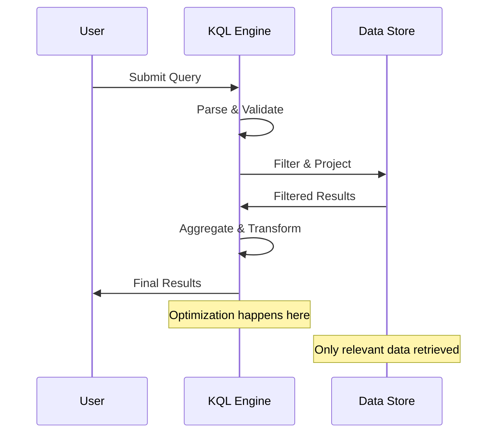
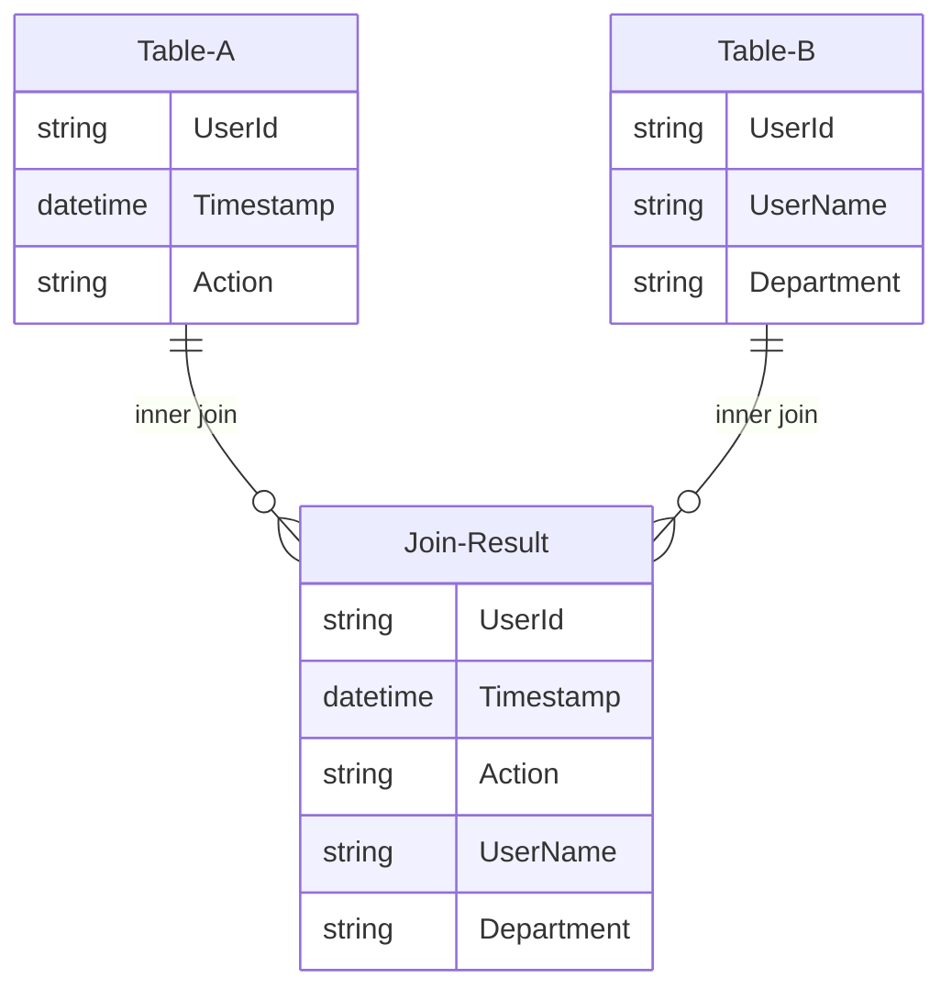
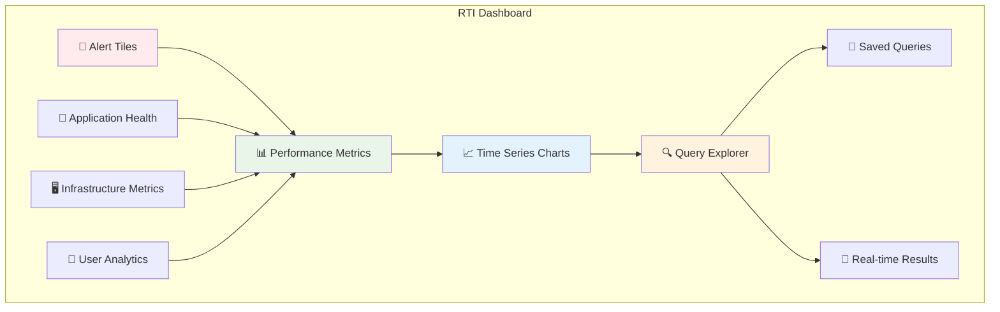
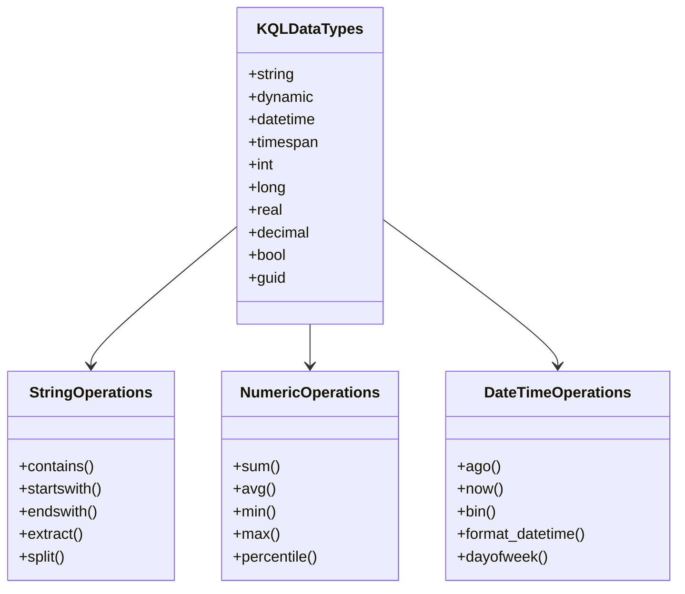
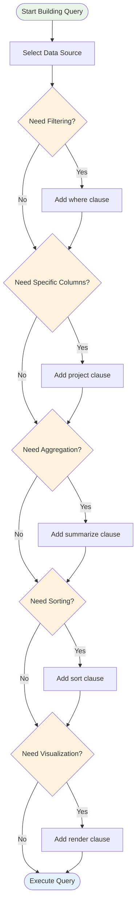

# KQL Visual Examples

This document contains visual examples and diagrams to supplement the main cheat sheet.

## 📊 Query Execution Flow



## 🎯 Performance Optimization Visual Guide

### ✅ Optimized Query Pattern


### 📈 Time Series Analysis Pattern

```mermaid
gantt
    title KQL Time Series Query Performance
    dateFormat  HH:mm
    axisFormat %H:%M
    
    section Data Ingestion
    Data Ingestion    :active, 09:00, 12:00
    
    section Query Execution
    Filter Data       :done, 10:00, 10:15
    Aggregate         :done, 10:15, 10:30
    Transform         :done, 10:30, 10:45
    Render Results    :active, 10:45, 11:00
```



## 🔄 Join Operations Visual



## 📱 Real Time Intelligence Dashboard Layout



## 🎨 Data Type Hierarchy



## 🔍 Query Building Workflow



## 📊 Common Query Patterns

### Pattern 1: Time-based Analysis
```
Data Source → Time Filter → Group by Time → Aggregate → Visualize
```

### Pattern 2: Error Analysis
```
Logs → Filter Errors → Parse Details → Count by Type → Alert if Threshold
```

### Pattern 3: Performance Monitoring
```
Metrics → Recent Time Window → Calculate Statistics → Compare Baselines → Dashboard
```

## 🎯 Best Practices Checklist

- ✅ **Filter Early**: Apply `where` clauses as early as possible
- ✅ **Project Wisely**: Only select columns you need
- ✅ **Time Bounds**: Always use time range filters for large datasets
- ✅ **Index Usage**: Leverage indexed columns in filters
- ✅ **Aggregate Smart**: Use appropriate aggregation functions
- ✅ **Cache Results**: Consider materialized views for frequent queries
- ❌ **Avoid**: Full table scans without filters
- ❌ **Avoid**: Complex regex on large datasets
- ❌ **Avoid**: Unnecessary joins
- ❌ **Avoid**: Too many columns in output

---

*These visual examples complement the main KQL cheat sheet. Use them to better understand query patterns and optimization techniques.*
